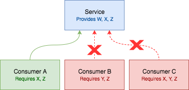

# Rivet
[](https://buildkite.com/itsthatguy/rivet) [](https://badge.fury.io/js/rivet)

[Docs](http://rivet.itg.sh) | [Issues](https://github.com/itsthatguy/rivet/issues)

# 

Rapid, modern web service development, which typically involves layers of microservices, reaches a point where a single, non-backwards-compatible API change affects multiple teams. This in turn leads to cascading service failures and finger-pointing. **Rivet** defines a solution where each service tests itself against real clients to assert that no interfaces have broken any clients at each step of the way.

* [Introduction](http://rivet.itg.sh/)
* [Consumer-Driven Contracts](http://rivet.itg.sh/consumer-driven-contracts.html)
* [Getting Started](http://rivet.itg.sh/getting-started.html)
* Contracts
  * [Configuration](http://rivet.itg.sh/contracts/configuration.html)
  * [Helpers](http://rivet.itg.sh/contracts/helpers.html)
  * [Composability](http://rivet.itg.sh/contracts/composability.html)
  * [Publishing](http://rivet.itg.sh/contracts/publishing.html)
* [CLI](http://rivet.itg.sh/cli.html)

## Getting Started

Install Rivet using npm:

```shell
npm install --save-dev rivet
```
Or via yarn:

```shell
yarn add --dev rivet
```

Read more in the [Getting Started](http://rivet.itg.sh/) docs.

### Vocabulary

Rivet uses _services_ and _consumers_ in describing these relationships.

* _Consumer_ — A client that talks to an API service
* _Service_ — An API service that consumers depend on for data

## The Problem

With these types of service relationships, trouble arises when you'd like to make a change to an API without breaking other consumers.

People use tools like API Blueprint, Swagger, or tests within the API's code itself to specify the requirements for an API. However, these tools and strategies do not account for the consuming applications that may break. You can change a response within the API's codebase and not know whether you've broken any given consumer.

## The Solution

By having the _consumers_ define their requirements through contracts, you gain direct visibility into any _consumer_-breaking change to a _service_. For example, if you are forced to make a backwards-incompatible change \(due to security, something upstream, or something simply out of your control\), making the _service_ aware of each client's requirements will tell you exactly what clients need to be updated to handle the change, whether or not you have versioned API mechanisms.




## Generic Metaphor

For example, take a factory that manufactures widgets:

Two customers come to have widgets made. The factory has a base widget _\(with twist it, bop it, spin it\)_ that it modifies for different customers' needs, defined in a contract.

* **Customer 1:** widget with twist it, bop it, spin it
* **Customer 2:** widget with twist it, spin it

* **Factory:** Removes _bop it_, without checking the contracts in place for their customer orders

* **Customer 1:** Now mad that they don't have a _bop it_ anymore

* **Customer 2:** Doesn't notice the change because it's not required

If the factory had checked the contracts that were in place, they would have known to add a _bop it_ for Customer 1. In this scenario, the Factory is a _service_, and Customers are _consumers_. It's absurd to imagine a Factory not checking manufacturing contracts before delivering their widgets. In the same way, it's absurd to imagine that in software, a _service_ doesn't check requirements before delivering a change.
